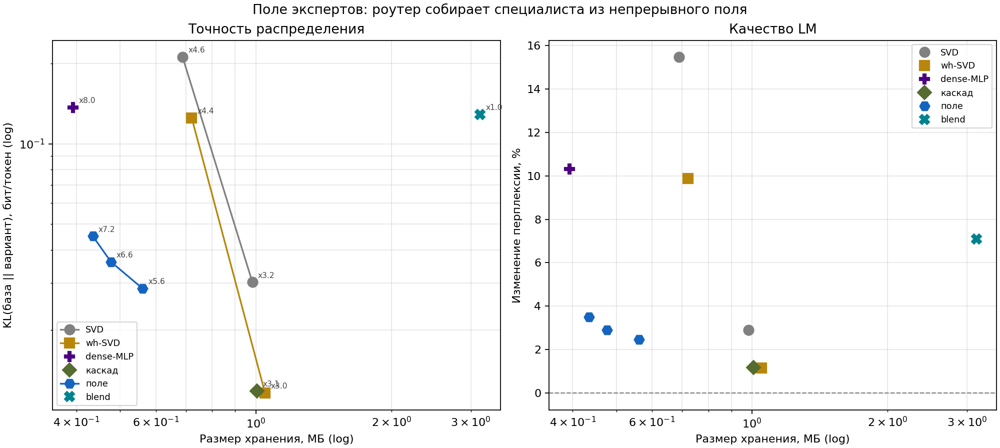

# The field engine: MoE without stored experts

## The problem

An MoE layer keeps N expert MLPs (OLMoE: N=64, top-k=8 per token) but uses
only a few of them for every token. Storing all N is the cost center: for
OLMoE-1B-7B the experts are **12.9 GB in fp16** while the attention backbone
is only ~1.5 GB. Classic compression (quantization) makes the experts
smaller but keeps the N-expert structure; the question this project asks is
whether the experts need to be *stored* at all.

## The idea

The router already computes soft weights `z = softmax(x @ Wg)` over the N
experts. Instead of N separate matrices, define a **field** over routing
space: an expert activated by routing vector z is

```
W(z) = W1d + U · diag(c(z)) · Vᵀ,        c(z) = z @ C
```

- `W1d` — the **centroid** (gate+up and down projections shared by all
  experts): the "average specialist";
- `U, V` — **low-rank factors** (rank r) that span the corrections on top of
  the centroid;
- `C` — a **coordinate table** (N × r): how much of each basis direction
  each expert uses; the router's z reads a weighted slice of it.

The router is kept **exactly as trained** — no router retraining, same
top-k, same softmax/norm. The experts are gone; what remains per MoE block
is `W1d + U, V + C`.

## Why a router-seeded field works at all

The naive version ("one averaged expert") collapses quality — that is the
`только центроид` bar in the variants chart. The win comes from the
**coordinates**: experts are correlated but not identical, and their
differences align with the routing directions (experts specialize on the
same axes the router separates by). Seeding the coordinate table from the
router geometry (`C` from the gate weights) and then fitting by SGD on real
activations recovers most of the expert function at a fraction of the
parameters. The experiments in [Research-History](Research-History.md) show
the ladder: centroid → PCA basis → per-expert SVD → **router-seeded field**,
each step buying KL orders of magnitude at the same storage.

## What is stored (per MoE block)

OLMoE numbers: d_model=2048, d_ff=1024, N=64 experts (top-8), 16 MoE layers.

| part | formula | params (r=32) | share |
|---|---|---|---|
| centroid W1d | 3 · d_ff · d | 6.29 M | 96.5% |
| factors U, V | r · (3 · d_ff + 2 · d) | 0.23 M | 3.5% |
| coordinates C | 2 · N · r | 4.1 k | ~0% |
| **field total** | | **~6.5 M vs 402.7 M explicit (x62 per block)** | |

All-layers accounting (fp16): **~12.9 GB → ~0.21 GB, x~60**; the artifact on
disk (~1.2 GB = backbone ~1 GB + field 0.21 GB) is *smaller than the source
Q4 GGUF* (4.4 GB). `field_dims.py` prints this exact table for any artifact.

## Deployment

The artifact is a normal HF model folder: `config.json` (with a `field`
section), `model.safetensors`, and `modeling_field.py` — a ~100-line modeling
file whose `FieldSparseMoe` implements the formula above. No custom runtime:

```python
from transformers import AutoModelForCausalLM
m = AutoModelForCausalLM.from_pretrained("results/field_..._r32",
                                         trust_remote_code=True)
```

Stored in bf16, computed in fp32 (dequant at load). The artifact loads
without a GPU; RAM ≈ artifact size + ~1 GB.

## Quality protocol (the short version)

Everything is measured as `KL(base ‖ field)` in bits/token on held-out
windows plus perplexity delta, against **the same quantized model the GGUF
contains** (per-block dequant is bit-identical to what the quantized model
computes — no "separate baseline model"). Mini-PoC reference numbers
(4-layer toy, same procedure): r=32 → KL 0.029 bits/token, Δppl +2.5% at
x5.6 expert compression; the full OLMoE runs are reported by the pipeline
into `results/moe_hf_pipeline_report.md`. Generation quality is a separate
topic — see [Quality-and-Calibration](Quality-and-Calibration.md).

## Where the field sits vs the baselines



At equal storage the router-seeded field dominates plain SVD by ~an order of
magnitude in KL; "blend" (field + SVD of the residual) closes most of the
remaining gap at x1.0 memory — the chart that motivated making the field the
product. Full story with all baselines:
[Research-History](Research-History.md).
