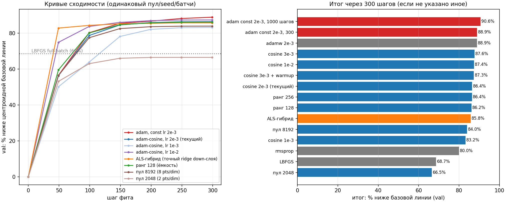

# Memory and speed: how the pipeline protects the machine

The design constraint: **the full model never loads**. Everything heavy is
streaming or runs on disk caches. On OLMoE-1B-7B the whole pipeline fits in
~3 GB of RAM peak and ~8.6 GB of disk, most of which is the GGUF itself.

## Streaming inference (`hf_stream.py`)

Only the backbone (~1.5 GB for OLMoE) lives in RAM. When a layer's pass
needs its experts, they are dequantized **straight from the GGUF on disk**
(~5 s CPU per block load), used, and released; the NEXT block is being
dequantized by a background prefetch thread while the current layer
computes. Per-block dequant is bit-identical to the full converter, so the
"base" being measured is exactly the quantized model in the GGUF — not a
re-export.

Knobs:

- `--prefetch 0` — disable the background reader (saves ~1 block of RAM);
- `--io-threads 2..4` — parallel dequant threads for the expert tensors
  (faster block loads on multi-core CPUs);
- `--io-cache ram` — copy the packed GGUF tensors into RAM on first touch
  (~= packed file size). Every later pass (pool collection, refits, artifact
  write) then reads **nothing from disk** — the big win on Colab/Drive or an
  HDD. A process-wide cache shared by all passes; correctness is covered by
  `test_io_cache.py` / `test_io_cache_stream.py`.

## Disk layout (OLMoE Q4_K_M)

| what | size | note |
|---|---|---|
| GGUF source | 4.4 GB | erasable after success (`--cleanup`); everything rebuilds without re-downloading |
| pool cache (`results/cache_*/`) | ~2.3 GB | pairs + centroids + log-probs; reusable for ANY rank; NOT touched by `--cleanup` |
| field fit (`cache_*/fit_r32/`) | ~0.7 GB | per rank; a new rank adds another fit dir, the pool is shared |
| artifact (`results/field_*_r32/`) | ~1.2 GB | backbone fp16 + field; smaller than the GGUF |
| **free disk needed** | **~8.6 GB** | with `--cleanup` after success ~4.2 GB remain |

By default there is **no 14 GB dequant checkpoint** — weights are read from
the GGUF directly. `--full-dequant` brings the old path back (faster block
reads on a fast SSD, checkpoint deletes itself after success;
`--keep-dequant` overrides).

## Fit economics

The fit (stage 5) runs **without the model in RAM** (peak ~1-2 GB): it reads
pair tensors from the pool and regresses each block's field on them. Blocks
are independent:

- `--fit-workers 2..4` — parallel workers (each gets `(cores / workers)`
  torch threads; set `--threads` to pin the total);
- `--fit-preset fast|balanced|quality` — steps/batch/lr bundles
  (fast ≈ 2.5x quicker);
- `--fit-method adam|adamw|adam-cosine|rmsprop` — the optimizer benchmark
  (below) is why `adam-cosine` is the preset default;
- `--fit-early-stop 50` — stop a block after 2 flat mse checkpoints;
- `--fit-jitter 0.2..0.3` — variance reduction for SMALL pools (<8 pairs/dim);
  at 16+ pairs/dim prefer 0.

Left: convergence curves on the same pool/seed/batches; right: the final
"share below the centroid baseline". Practical reads: Adam at constant
lr 2e-3 with enough steps is the ceiling (+90.6% at 1000 steps); the cosine
schedule at 300 steps is within ~3 points of it; ALS hybrid and rank bumps
buy little for their cost; pool size 8192 (8 pts/dim) already saturates —
2048 loses ~20 points. LBFGS is not competitive.

## Low-mem mode

`--low-mem` halves the metrics caps (`per-layer-cap → 4096`, `kl-chunks → 8`,
`eval-ctx → 256`, smaller calibration batches) — lower RAM, nearly the same
metric quality. Combined with the default streaming path, 8 GB machines are
comfortable end-to-end.

## Where things download

The HF cache is redirected **into the project** (`hf_env.py`, imported
first everywhere), so nothing lands on the system drive — relevant for
Colab and shared machines. See `hf_cache/` in the project root.
