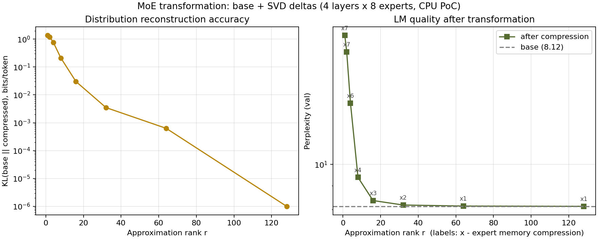
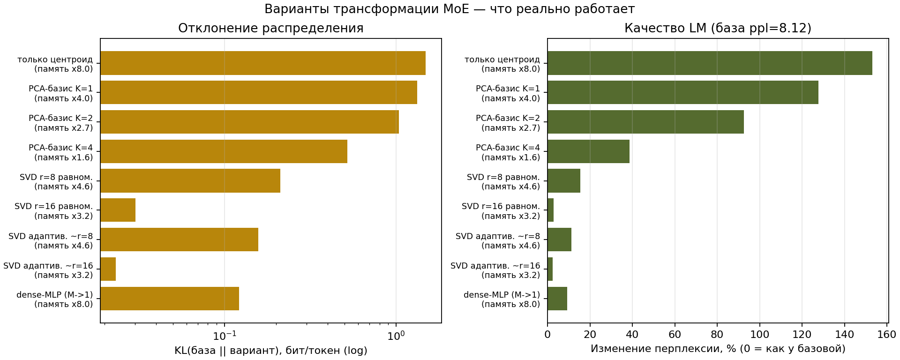
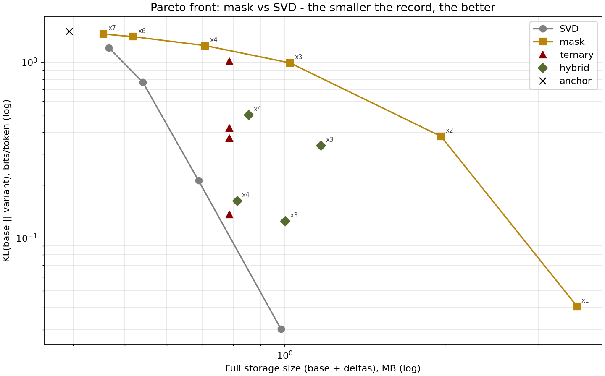
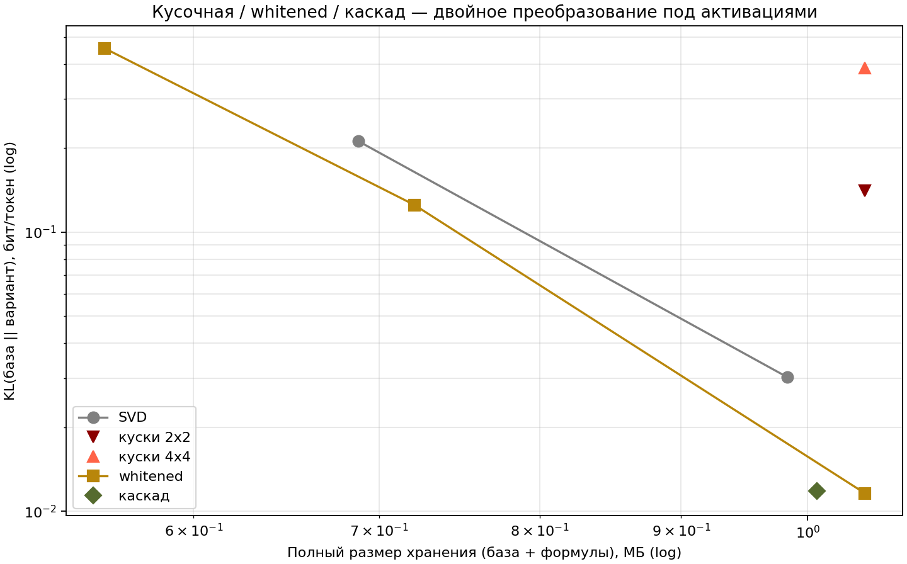
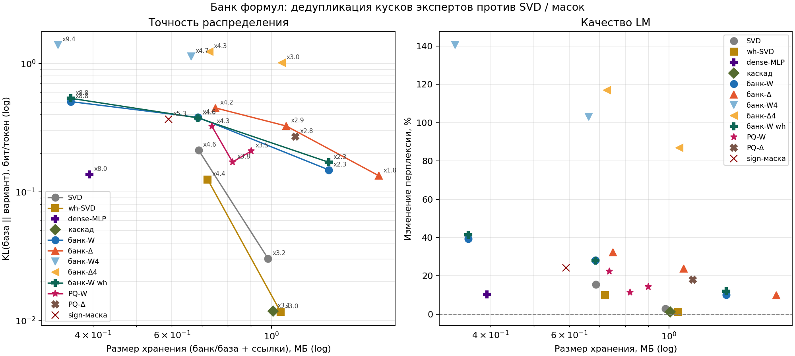

# Research history: the ladder that led to the field

The method did not start as "the field". It started as a question — *do we
need to store expert weights at all?* — and a ladder of experiments on a
trained mini-MoE (4 layers, d=128, 8 experts top-2), each replacing the
expert bank with something smaller. Every rung is kept in the repo
(`pipeline.py` + `*_eval.py`); this page walks the ladder with the charts.

## Rung 0 — can per-expert SVD even work?

Compress each expert with its own low-rank SVD. Left: KL falls ~linearly
(in log space) with rank — the approximation itself is smooth. Right: ppl
snaps back to the base line around **x3-x4 expert-memory compression**, then
flatlines: per-expert SVD saturates. Beyond that point you pay storage for
nothing. Conclusion: rank alone will not reach high compression — the
*structure across experts* must be exploited.

## Rung 1 — which transform family survives?

Eight transform variants, one chart: centroid-only (x8.0 memory) collapses;
a PCA basis shared by experts helps a bit; uniform per-expert SVD r=16 is
decent; **adaptive SVD** (rank allocated per expert by importance) and the
dense-MLP mapping (M→1) are the only ones keeping KL under ~0.1 at x3-x8
compression. Two lessons: (1) shared structure beats per-expert structure;
(2) a *learned nonlinear* map (dense-MLP) is surprisingly strong — but it
loses the "expert = matrix" shape that makes MoE interpretable.

## Rung 2 — masks, ternary, hybrids (Pareto view)

Pruning/mask families vs SVD on the same axes. Masks at x1 compression win
(they barely lose anything), but the whole mask/ternary/hybrid family sits
*above* the SVD curve everywhere else — at matched storage, low-rank beats
sparsity for these dense expert matrices. The "anchor" point (x11) is a
centroid anchor + deltas variant: worst of both worlds at this scale.

## Rung 3 — whitening and two-stage transforms

Fitting "under activations" (whiten the input space before SVD; cascade =
centroid + whitened residual stage) moves the whole curve down ~an order of
magnitude in KL at the same storage — the first big win from using the
*data* distribution, not just the weights. Piecewise block-diagonal
approximations (2x2, 4x4) are not competitive. This rung introduced the
calibration-pool machinery the field fit uses today.

## Rung 4 — the formula bank (dedup idea)

Store a "bank" of reusable rank-1 formulas and express every expert as
references into it (bank-W = shared basis, bank-Δ = delta codes; PQ-W/Δ =
product quantization variants). Interesting at the low-compression end
(bank-Δ at x1.8 beats SVD x3.2), but the family plateaus around KL 0.1-0.3
at x2.9-x4.7 — reference tables are not cheap enough for the errors they
leave. The bank idea survives in spirit: the field's coordinate table C is
exactly a (much cheaper) reference mechanism.

## Rung 5 — the router-seeded field

The synthesis: experts are a **field over routing space** —
`W(z) = W1d + U · diag(z @ C) · Vᵀ`, seeded from the router and fitted on
captured activations (the whitening lesson), with the router kept exactly as
trained. At matched storage the field dominates SVD by ~10x KL
("поле" curve, x5.6-x7.2 compression); `blend` (field + a small SVD of the
residual) reaches the SVD-family floor at x1.0 memory. This is the design
that became the product — see [Field-Engine](Field-Engine.md).

## Rung 6 — making the fit honest and cheap

The final engineering rung, three findings in one chart:

1. **The leak fix.** Calibration and eval must be disjoint text segments.
   Before the fix, activation-aware methods (field included) showed
   ~10-20% better KL by training on the eval segment; after the fix the
   numbers above are the honest ones (weight-space methods reproduced byte
   for byte, confirming the protocol).
2. **Optimizer.** Plain Adam with a constant lr 2e-3 is the ceiling;
   `adam-cosine` at 300 steps lands within ~3 points — the `balanced`
   preset default. LBFGS, ALS hybrids, rank bumps: not worth it.
3. **Pool size.** 8192 pairs/block (8 pts/dim) saturates; 2048 loses ~20
   points — this is where `--per-layer-cap` defaults come from.

## Where the numbers live

- `examples/toy_report/` — the mini-PoC report bundle (committed);
- `results/moe_pipeline_report.md` / `moe_hf_pipeline_report.md` — generated
  by your runs;
- every chart above is regenerated by the matching `*_eval.py` in the repo.
